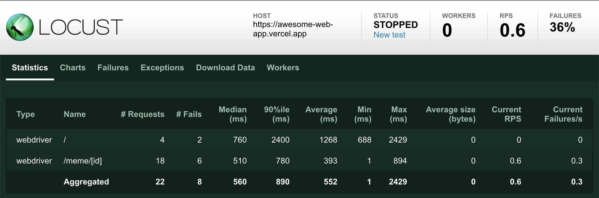
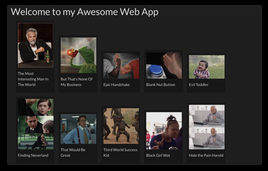

# locust-load-testing-tool

Demonstrates a way to perform user load testing on website using [locust](https://locust.io).

Check the `locust/locustfiles` folder to see the actual testing code.

There's also a sample web app project that can be found in the `awesome-web-app` folder.
It is built upon the fabulous [Next.js](https://nextjs.org) framework, which has been deployed to [Vercel](https://vercel.com) (formely now.sh)

Check the site here: 

# Requirements

You need Docker, Docker Compose, Node to run this project.

# Build

To build the Docker images, just do `make build`.

No need to run this directly unless you changed anything the code.
The run command is able to build the images when needed.

# Run

There are some run modes to chose from:

## Webdriver client (interacts with a real web browser)

In this mode we use a custom Locust **client** and **user** that interacts with a selenium webdriver running chrome.
Despite this not being the recommended way, it's here for educational purposes only.

Note that we actually make the initial request, let the browser render it, then we parse the final HTML using the BeautifulSoup library to extract some data.
This is especially useful for Client Side Rendering.

To test the web app running local, run `make start-browser-local`.

If you want to test the deployed version of the web app, running at Vercel, run `make start-browser-remote`.

## Standard client

This is the best way to do this kind of performance tests IMO.

You also have to ways to start the tests, either local or remote:

* Local: `make start-standard-local`
* Remote: `make start-standard-remote`

# Alternatives

The aim of the whole project is to propose a way of doing performance tests.
This is just one way, there are several other ways, often to achieve different kinds of results.

Here a quick list of other useful tools I've used:
* [ApacheBench](https://httpd.apache.org/docs/2.4/programs/ab.html)
* [Hey](https://github.com/rakyll/hey)
* [JMeter](https://jmeter.apache.org/)
